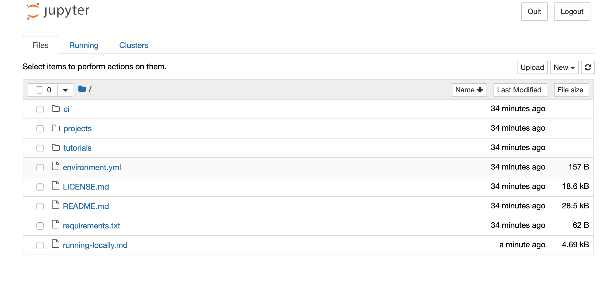

# How to get started on python tutorials without using google colab or other online service.

We recognize that some of our students will not be able to access google colab or have slow internet.  So this set of instructions is to help you get an alternative environment up and running.  You're going to be using a tool that's very similar to google colab called jupyter notebooks. (In fact google colab is just google's evolution of a jupyter notebook.) We have provided written instructions for macOS / Windows / Linux operating systems below.

### VIDEO INSTRUCTIONS
- macOS -- [Precourse Getting started with Python: Jupyter Notebooks Mac OS](https://www.youtube.com/watch?v=ex3W0QVQioU&feature=youtu.be)
- Windows -- UNDER CONSTRUCTION
- Linux -- UNDER CONSTRUCTION

## Step 1: Install Miniconda (or Anaconda) package manager

You'll need to [download and install Miniconda](https://docs.conda.io/en/latest/miniconda.html) for your operating system [Mac / PC / Linux].  

Miniconda is a small (<100MB) application that helps set up programming environments. There is an alternative setup called [Anaconda](https://docs.anaconda.com/anaconda/install/) which includes about 3GB of packages. If you have a slow internet connection (or not too much disk space) Miniconda is recommended.

The rest of the steps will be somewhat specific to your operating system, so navigate to the operating system you are using.

## macOS / Linux

### Step 2: Clone/download this repository

You will need a local copy of this repository to run the notebooks. If you have `git` installed you can run:

```bash
cd ~/Documents/;
git clone https://github.com/erlichlab/course-content
```

If you don't have `git` you can just download this [zip file](https://github.com/erlichlab/course-content/archive/master.zip). 

### Step 3: Create the python programming environment for these tutorials

First, change into the `course-content` folder. Then in your terminal (note: if you had a terminal window open before you installed `conda` in Step 2, you need to open a **new** window to give `conda` a chance to do some setup).

    conda env create --file=environment.yml

This will download all the packages you need to run the course content and create an _environment_ called `nma`. It may take a few minutes to complete the installation.

Now activate the environment!

    conda activate nma

When you are done with using the course content you can just close the window or you can deactivate

    conda deactivate

### Step 4 - Opening a jupyter notebook
Run the following command:

	jupyter notebook

This should open up your default browser with a web page that looks like this:



A single click on tutorials, will take you to a list of folders for each tutorial:


Then click on the folder you want to work on e.g. `W1D1_ModelTypes` and click on on the Jupyter notebook you want to work on (e.g. `W1D1_Tutorial1`)

You 


## Windows

### Step 2: Create a folder for your python tutorials
First make a folder where you'll keep your jupyter notebooks for the python tutorials.  I'm going to make a folder in Documents called python-tutorials-2020.

### Step 3: Create the NMA programming environment
Now we need to create the conda environment.  [This blog post](https://heartbeat.fritz.ai/creating-python-virtual-environments-with-conda-why-and-how-180ebd02d1db) by [Okoh Anita](https://heartbeat.fritz.ai/@anitaokoh) is helpful for describing why we need environments when we program and how you create them.  Below I provide instructions for the steps we'll take to create an environment for the python tutorials.

We need to create an environment.yml file that contains:

	name: nma-prep
	channels:
	  - conda-forge
	dependencies:
	  - matplotlib
	  - numpy
	  - python=3.7
	  - scipy
	  - ipywidgets
	  - jupyter
	  - nb_conda
	  - pandas

Open Notepad. Copy and paste the contents above into that file.  Save the document in the folder you created and name it environment.yml

Now open the Anaconda Navigator and launch the CMD.exe Prompt. Navigate to the folder you just created using the 'cd' command. [cd stands for change directory] You will have to adjust this file directory location according to where you have placed your folder. 

`cd C:/Documents/python-tutorials-2020`

Now we can install the environment.  Run the following command to create the environment. 
	
	conda env create

It may take a few minutes to complete the installation.

Now activate the environment!

	conda activate nma-prep

### Step 4 - Opening a jupyter notebook
Run the following command:

	jupyter notebook

This should open up your default browser.  In the upper right-hand corner, click the button labelled new.  This will bring up a drop-down menu.  Click on the option labelled: Python [conda env:nma-prep].  This will open a new tab.  You have successfully opened a jupyter notebook!  You can now use this programming environment to start working on the python tutorials. 
